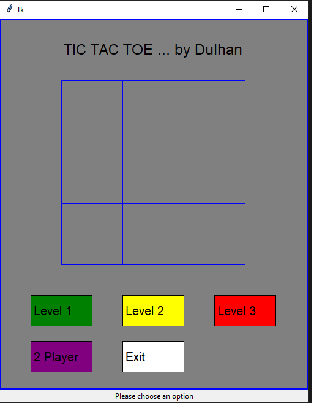

# TicTacToe

This was one of the first programs that I wrote. It's a GUI for a Tic Tac Toe game. It comes with a total of 4 playing modes:

* 2-player mode (human vs. human)
* Computer (Easy Level) vs. human
* Computer (Medium Level) vs. human
* Computer (Hard Level) vs. human

The easy level uses random moves. The medium level uses a combination of random and defensive moves. The hard level uses a combination random, defensive, and attacking moves.

Here's what it looks like at the start:  

